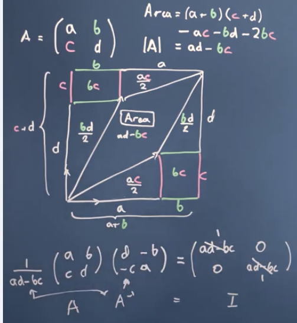

# Linear algebra 
- is a branch of mathematics that deals with vectors, matrices, and linear transformations, focusing on systems of linear equations and their solutions.

## linear vs non-linear algebra
- Linear algebra is the backbone of ML because it's fast, scalable, and interpretable.
- Non-linearity is introduced in a structured way (e.g., activation functions, kernels).
- Purely non-linear algebra would be too slow, complex, and hard to optimize for large-scale ML models.

## Vector:
> arrows pointing in space, direction and length
> list of numbers (ml)
> unit vectors (basis vector)
> scalars scale the basis vector, we can chose basis vectors
> The basis of a vector space is a set of linearly independent vectors that span the full space
  - 

# Modulus

# dot product
- Measures influence in the same direction → Perpendicular means no influence (0)

# cosine

# Scalar projection

# Vector projection

- While scalar projection gives us just a number (the magnitude), vector projection gives us an actual vector that shows how much one vector "pushes" in the direction of another.
- The vector projection of A onto B is the part of A that actually points along B. It tells us:
How much of A is in the direction of B (like scalar projection).
A new vector that represents this portion, instead of just a number.
So instead of just knowing how much a vector contributes, we now also know in which direction this contribution happens.

--- 

- **Changing basis vectors & projection**
  
- **Why Is It Easier with Orthogonal Vectors?**
    - No Interference Between Components
        - When two vectors are orthogonal, changing one coefficient does not affect the contribution of the other.
        - This makes solving for the coefficients straightforward.
    - Independent Contribution in Each Direction

### Intuitive Example of Projection in ML & DL 🚀
    Imagine you’re tracking shadows on the ground.

    🏀 Example: Basketball Player’s Shadow
    Let's say a basketball player is standing under a streetlight at night. The streetlight is directly above them.

    The player is the data point (vector) in 3D space (height, width, depth).
    The ground is the 2D plane we want to project onto.
    The player’s shadow is the projection of the vector onto that plane.
    👉 If the light moves to the side, the shadow changes—just like how different basis vectors (coordinate systems) can change how we represent data.

    Why is this useful?
    If we only need the shadow to analyze movement, we can ignore the 3D data and work in 2D (dimensionality reduction like PCA!).
    If we want to compare players, we can normalize shadows so that only their movement matters, not their height (normalization in ML!).
    If we use different lights, the shadow changes → this is like choosing different basis vectors in ML.

## Matrices
 - transforming the basis vectors/space 
 **Linear Transformation:**
 > line remains a line after transformation
 > origin remains same after transformation
 - various transform matrices 
 - Absolutely! Let’s build an intuitive understanding of matrices, basis vectors, and transformations. Think of matrices as "machines" that stretch, squash, rotate, or shear space. To grasp this, we need to visualize basis vectors and how they define the "rules" of the space.
    - matrices change the basis vectors and their magnitudes, and because vectors are expressed in terms of these basis vectors, the vectors themselves also change accordingly.

    - Basis Vectors: The DNA of Space
    Basis vectors are like the rulers and protractors that define your coordinate system. For example:

    In 2D, the standard basis vectors are:
    v = ae1 + be2 (e.g., [3] = 3e1 + 2e2).
                         [2]

    - Coordinates as "Recipes"
    Any vector v = [x  is a recipe: "Move x units along e1, then y units along e2."
                    y] 
    After transformation, the same recipe applies to the new basis vectors:
    Av = x(new e1) + y(new e2).

# Matrix Inverse
  Gaussian Elimination
  - elimination of rows
  - back substitution
  
  Inverse of Matrix 
    - now tips to eliminate the rows to find the inverse ****
  - determinants and inverses
    - area of the vector space 
    - proof of determinates giving inverses 
    - if determinant is zero , that says the matrix is non-inverse and we can't solve the system of equations
    - we can't tranform the matrix aswell, as the determinate is zero and there is no inverse. If tranformed, we cannot bring it back as the dimensions are collapsed
    *** det is zero -> basis vectors are not linearly independent -> that mean inverse doesn't exist

# Einstein Summation Convention
  matrix multiplication - 
  dot product symmetry  - 